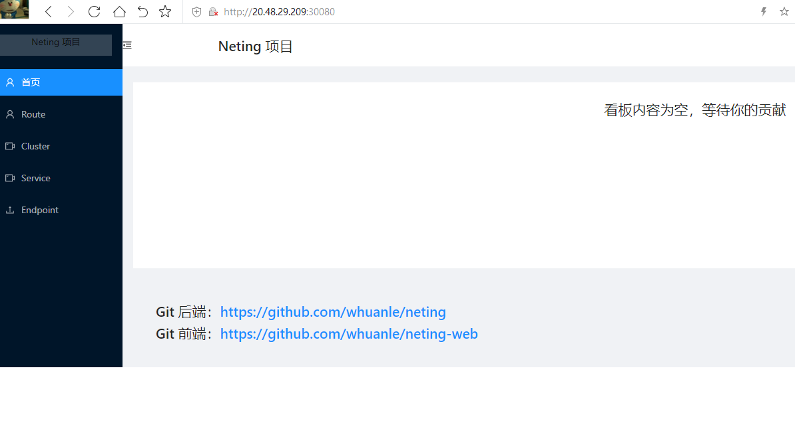
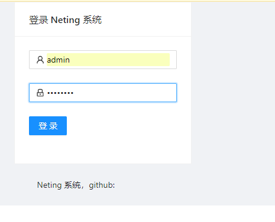
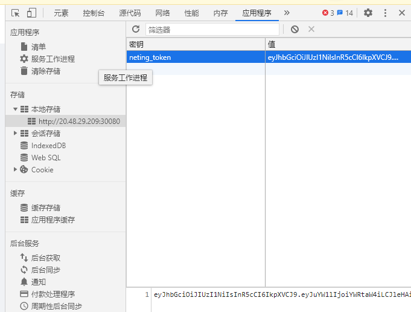
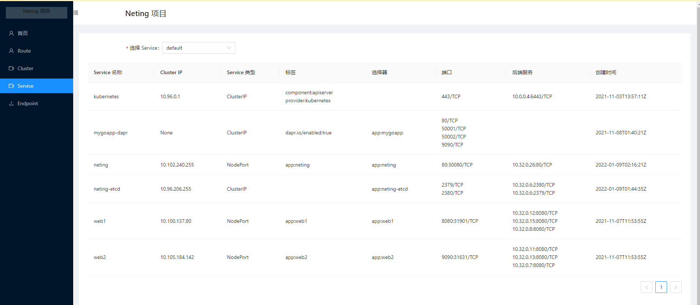
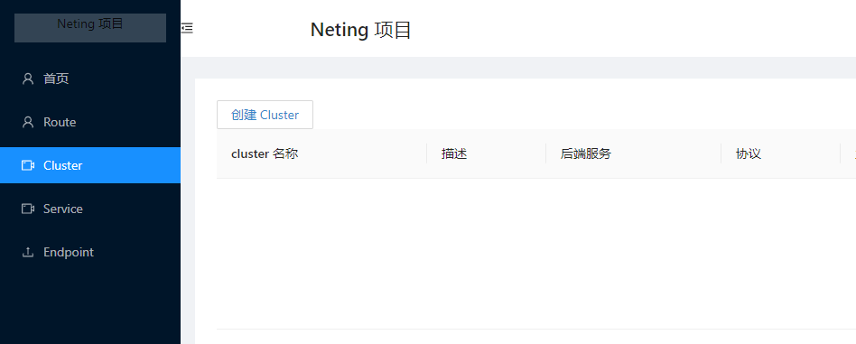
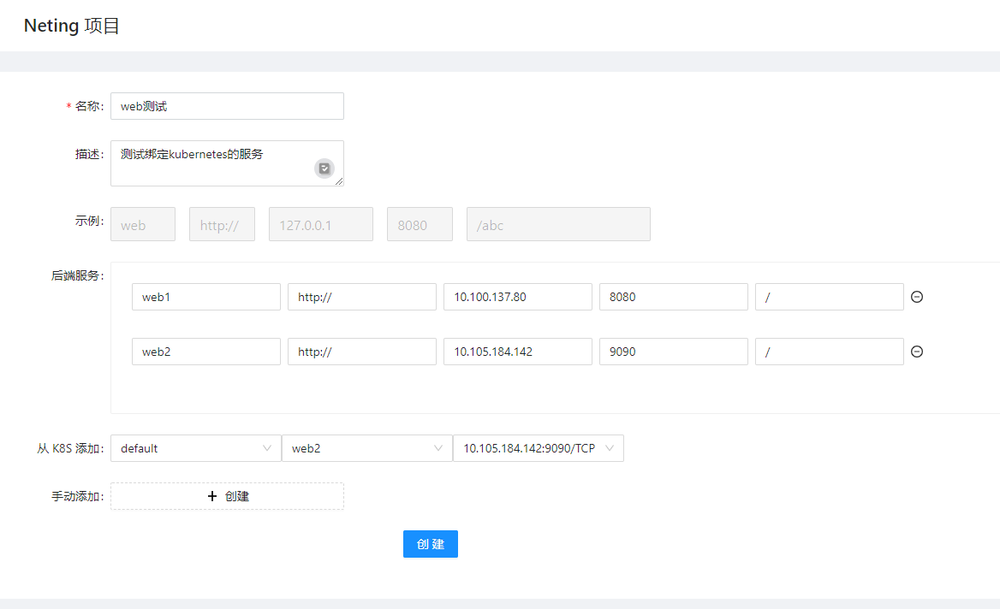
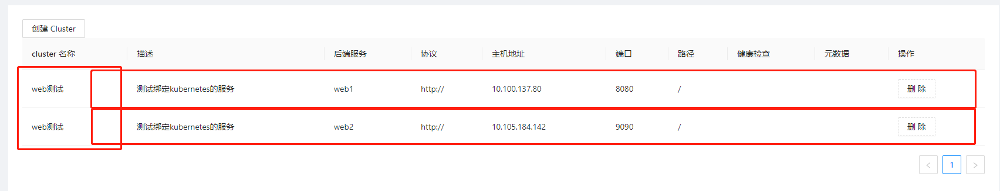
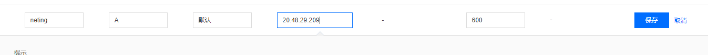
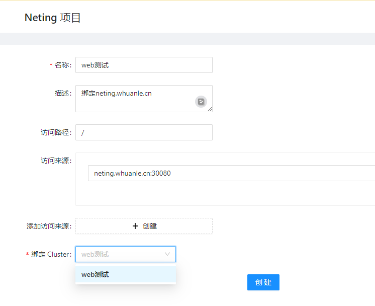
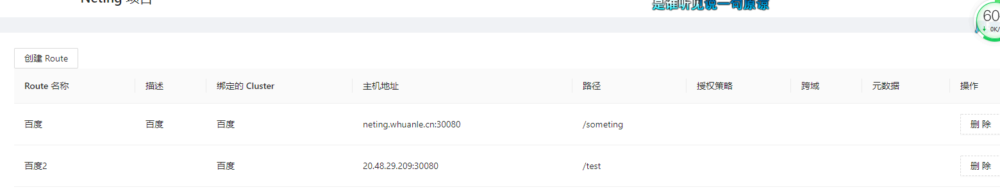

# neting
1，完成创建 Cluster、Route，存储到 ETCD，并且 Watch，刷新数据到内存
2，完成 Cluster、Route 配置映射到  Yarp
3，创建前端基架


初始化开发环境

```
set NETING_USER=admin
set NETING_PASSWORD=admin123
set NETING_TOKENKEY="dzbfhisj@3411DDFF5%$%^&&"
```


Neting 使用 etcd 作为存储后端，etcd 支持集群，但是这里为了方便使用单个 etcd 实例。因为 etcd 是有状态应用，因此需要绑定一个存储卷。另外 etcd 也需要创建一个 service，以便在集群中访问实例。

```
etcd 集群(这里是单实例集群) ->  Service(名称为neting-svc)
     ↓
PersistentVolumeClaim
     ↓
PersistentVolume
```


为了方便，创建的存储卷是本地卷，不能跨节点共享数据。当然你也可以通过修改 neting-etcd.yaml 文件，使用其他类型的卷。

```
  hostPath:
      # 宿主上目录位置，需要先提前创建
    path: /data/etcd
      # 此字段为可选
    type: Directory
```


你可以在 neting-etcd.yaml 中看到此配置的全部。

```bash
root@master:~/neting# kubectl apply -f neting-etcd.yaml 
service/neting-etcd created
statefulset.apps/neting-etcd created
persistentvolume/neting-etcd created
```


也顺带创建了三个资源。

```bash
root@master:~/neting# kubectl get statefulset
NAME          READY   AGE
neting-etcd   1/1     36s

root@master:~/neting# kubectl get pv
NAME          CAPACITY   ACCESS MODES   RECLAIM POLICY   STATUS
neting-etcd   1Gi        RWO            Recycle          Available

root@master:~/neting# kubectl get svc
NAME           TYPE        CLUSTER-IP       EXTERNAL-IP   PORT(S)                               AGE
neting-etcd    ClusterIP   10.96.206.255    <none>        2379/TCP,2380/TCP                     54s
```

> 其实还包括 PersistentVolumeClaim，可以执行 `kubectl get pvc` 查看。


Neting 需要知道 etcd 的 IP 地址，以及配置 Neting 启动配置，如登录账号密码等。

这个配置写在了secret.yaml。


```
apiVersion: v1
kind: Secret
metadata:
  name: neting-basic-auth
type: Opaque
stringData:
# Neting 的登录账号密码
  NETING_USER: admin
  NETING_PASSWORD: admin123
  NETING_TOKENKEY: dzbfhisj@3411DDFF5%$%^&&
```


这个配置很简单，其中 NETING_TOKENKEY 表示签名 token 的密钥，Neting 使用 Jwt Token 做用户凭证，在颁发凭证给用户时，需要加密用户信息签名。

Secret 中的信息最终会生成 base64，存储到 etcd 中。

```bash
root@master:~/neting# kubectl apply -f secret.yaml 
secret/neting-basic-auth created

root@master:~/neting# kubectl get secret
NAME                      TYPE                                  DATA   AGE
neting-basic-auth         Opaque                                3      10s
...
data:
  NETING_PASSWORD: YWRtaW4xMjM=
  NETING_TOKENKEY: ZHpiZmhpc2pAMzQxMURERkY1JSQlXiYm
  NETING_USER: YWRtaW4=
kind: Secret
```


```
Neting -> 启动(Secret)
 ↓
Service - etcd
 ↓
etcd 实例
```


Neting 是由 ASP.NET Core API + React/Ant Design 编写的 Web 项目，为了结构简单，Neting 在 wwwroot 目录托管了前端静态文件，以便在同一个端口下访问，并且减少跨域、绑定 IP 等事情。


Neting 已被上传到 registry.cn-hangzhou.aliyuncs.com/whuanle/neting:review1.0

Neting 是需要在 Pod 中连接到 Kubernetes API Server 的，因此需要配置 ServiceAccount 或者直接使用 Kubeconfig。遗憾的是，C# 的 KubernetesClient 对 ServiceAccount  支持并不好，因此只能使用 Kubeconfig，当然直接使用 Kubeconfig 可能会带来一些安全问题，好在这是 Demo，Neting 只会使用 获取 Servive 和 Endpoint 部分的信息，不会对集群进行修改、删除等操作，因此如果需要更高安全级别的操作，可尝试自行解决 Kubenetes - C# 的 ServiceAccount  问题。。


将你的 Kubernetes 管理配置文件复制到 `/root/.kube/config` 中。注意，这一步一定要在会被调度 Pod 运行的节点上处理，因为这个不能跨节点使用

```
cp -f /etc/kubernetes/admin.conf /root/.kube/config
```


然后启动 Neting：

```
kubectl apply -f neting.yaml
```


接着，为 Neting 创建 Service，以便在外网访问。

```bash
root@master:~/neting# kubectl apply -f neting-svc.yaml 
service/neting created

root@master:~/neting# kubectl get svc -o wide
neting         NodePort    10.102.240.255   <none>        80:30080/TCP                          11s   app=neting
neting-etcd    ClusterIP   10.96.206.255    <none>        2379/TCP,2380/TCP                     31m   app=neting-etcd
```




接着随便点击一个菜单，便会要求登录。

账号密码分别是 `admin`、`admin123`。




登录后，凭证会存储到你的浏览器中，有效期为 7 天。




点击 Service 可以看到集群中的 Service，




接着我们来创建反向代理。

 

Yarp 的反向代理对象绑定分为两个部分，Route 和 Cluster。

Cluster 即是服务后端实例，如你有一个应用部署了 N 个实例，每个实例都有一个 IP，那么 Cluster 需要记录你这些实例的 IP，以便在访问时，通过负载均衡算法选择其中一个访问。YARP 带有内置的负载平衡算法，但也为任何自定义负载平衡方法提供了可扩展性。这里就不展开来讲。

读者可以参考 https://microsoft.github.io/reverse-proxy/articles/load-balancing.html
















