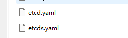

### 关于 Neting

刚开始的时候是打算使用微软官方的 Yarp 库，实现一个 API 网关，后面发现坑比较多，弄起来比较麻烦，就放弃了。目前写完了查看 Kubernetes Service 信息、创建 Route 和 Cluster 和绑定 Kubernetes Service。简单来说，就是完成了基础部分，配置路由和后端服务绑定，如果想实现动态路由和直接转发等功能，只需要按照官方的文档，增加中间件即可。


原本打算使用 .NET 6 的 AOT(一共40MB) ，但是打包运行会容易出现一些依赖问题和环境问题，因此放弃了，依然采用 Runtime + 应用 的方式部署，进行总共 120 MB 左右。

后端项目地址：https://github.com/whuanle/neting 

前端项目地址：https://github.com/whuanle/neting-web


体验地址：http://neting.whuanle.cn:30080/

大概界面是这样的：


Route：即来源入口，支持 http/https 和 gRPC，Route 是设计进入集群前的访问者流量如何绑定后端服务，可以配置访问者 URL 的区配规则；

Cluster：后端服务，一个 Cluster 可以绑定多个类型的后端服务，主要实现一个域名不同的后缀访问多个微服务，或者同一个实例负载均衡等；

Service：查看 Kubernetes Service 的一些网络信息；


Neting 目前只实现了简单的配置，仅供读者了解 Yarp 以及入门 Kubernetes API 开发、监控集群资源等。读者也可以从中了解 etcd 的使用，如何设计一个 Kubernetes Controller 应用。


基础功能已经做了，读者可根据需求，自行增加中间件即可。


下面介绍如何部署 Neting 项目，需要读者提前创建好集群。


谈谈对 Yarp 的看法。

首先，Yarp 的仓库地址是 https://github.com/microsoft/reverse-proxy

仓库在微软的官方账号下，从了解到的信息来看，Yarp 的出现主要是解决 Microsoft 内部的需求，也有人说是为了给 Azure 用。仓库代码目标也是主要解决微软内部需求，很多 API 对外部开发者也不是很友好，实际开发起来有一定难度，当然可定制性也比较多，主要从 ASP.NET Core 的中间件下手，做各方面的扩展。

另外这个项目不是成熟项目，Yarp 只是一个库，它不是一个完整应用，很多地方还没有确定其稳定性，也没有性能测试报告等，也没有基于此的成熟的应用出现。API 上和其他方面，开发难度还是比较复杂的，包括文档很多地方也没有说清楚。


### 部署 etcd

Neting 的主要设计，是 etcd 作为数据存储后端，当用户创建反向代理或者其他类型的规则时，etcd Watch 自动通知 Neing 实例，刷新这些配置到内存中，交由 Yarp 使用(当然也可以不放到内存，在需要使用的时候，自动从 etcd 中取)。

Neting 使用 etcd 作为存储后端，etcd 支持集群，但是这里为了方便使用单个 etcd 实例。因为 etcd 是有状态应用，因此需要绑定一个存储卷。另外 etcd 也需要创建一个 service，以便在集群中访问实例。

```
etcd 集群(这里是单实例集群) ->  Service(名称为neting-svc)
     ↓
PersistentVolumeClaim
     ↓
PersistentVolume
```

你可以在项目的 yaml 下面，找到 etcd.yaml 和 etcds.yaml 、neting-etcd.yaml  三个文件，查看如何部署 etcd 集群。




为了方便，创建的存储卷是本地卷，不能跨节点共享数据。当然你也可以通过修改 neting-etcd.yaml 文件，使用其他类型的卷。

```yaml
  hostPath:
      # 宿主上目录位置，需要先提前创建
    path: /data/etcd
      # 此字段为可选
    type: Directory
```


将 neting-etcd.yaml 文件上传到集群，然后创建 etcd 实例。

```bash
root@master:~/neting# kubectl apply -f neting-etcd.yaml 
service/neting-etcd created
statefulset.apps/neting-etcd created
persistentvolume/neting-etcd created
```


创建 etcd 集群的时候，会创建多个相关的资源。

```bash
root@master:~/neting# kubectl get statefulset
NAME          READY   AGE
neting-etcd   1/1     36s

root@master:~/neting# kubectl get pv
NAME          CAPACITY   ACCESS MODES   RECLAIM POLICY   STATUS
neting-etcd   1Gi        RWO            Recycle          Available

root@master:~/neting# kubectl get svc
NAME           TYPE        CLUSTER-IP       EXTERNAL-IP   PORT(S)                               AGE
neting-etcd    ClusterIP   10.96.206.255    <none>        2379/TCP,2380/TCP                     54s
```

> 其实还包括 PersistentVolumeClaim，可以执行 `kubectl get pvc` 查看。


### 创建 secret

secret 的主要作用是给 Neting 提供用户登录的账号密码，即前面提到的 `admin/admin123`，这个配置写在了 secret.yaml。

secret.yaml 的全部内容如下：

```yaml
apiVersion: v1
kind: Secret
metadata:
  name: neting-basic-auth
type: Opaque
stringData:
# Neting 的登录账号密码
  NETING_USER: admin
  NETING_PASSWORD: admin123
  NETING_TOKENKEY: dzbfhisj@3411DDFF5%$%^&&
```


这个配置很简单，其中 NETING_TOKENKEY 表示签名 token 的密钥，Neting 使用 Jwt Token 做用户凭证，在颁发凭证给用户时，需要加密用户信息签名。

上传 secret.yaml  到集群中，然后创建它。Secret 中的信息最终会生成 base64，Kubernetes 的 etcd 中(注，不是前面自行创建的 etcd)。secret 中的信息，最终会以环境变量的形式出现在 Neting Pod 中。

```bash
root@master:~/neting# kubectl apply -f secret.yaml 
secret/neting-basic-auth created

root@master:~/neting# kubectl get secret
NAME                      TYPE                                  DATA   AGE
neting-basic-auth         Opaque                                3      10s
...
data:
  NETING_PASSWORD: YWRtaW4xMjM=
  NETING_TOKENKEY: ZHpiZmhpc2pAMzQxMURERkY1JSQlXiYm
  NETING_USER: YWRtaW4=
kind: Secret
```


### 部署 Neting

Neting 的依赖关系如下：

```
Neting -> 启动(Secret)
 ↓
Service - etcd
 ↓
etcd 实例
```


Neting 是由 ASP.NET Core API + React/Ant Design 编写的 Web 项目，为了结构简单，Neting 在 wwwroot 目录托管了前端静态文件，以便在同一个端口下访问，并且减少跨域、绑定 IP 等事情。


Neting 已被上传到阿里云镜像仓库中，`docker pull` 地址 ： `registry.cn-hangzhou.aliyuncs.com/whuanle/neting:review1.0`


Neting 是需要在 Pod 中连接到 Kubernetes API Server 的，因此需要配置 ServiceAccount 或者直接使用 Kubeconfig。遗憾的是，C# 的 KubernetesClient 对 ServiceAccount  支持并不好，因此只能使用 Kubeconfig，当然直接使用 Kubeconfig 可能会带来一些安全问题，好在这是 Demo，Neting 只会使用 获取 Servive 和 Endpoint 部分的信息，不会对集群进行修改、删除等操作，因此如果需要更高安全级别的操作，可尝试自行解决 Kubenetes - C# 的 ServiceAccount  问题。

> Kubernetes 和 etcd 的 C#  SDK 体验不佳，读者搞云原生中间件的时候，还是用 Go 搞比较好，C# 适合写业务。


将你的 Kubernetes 管理配置文件复制到 `/root/.kube/config` 中。注意，这一步一定要在会被调度 Pod 运行的节点上处理，因为这个配置文件不能跨节点使用。

```
cp -f /etc/kubernetes/admin.conf /root/.kube/config
```


然后启动 Neting：

```
kubectl apply -f neting.yaml
```


接着，为 Neting 创建 Service，以便在外网访问。

```bash
root@master:~/neting# kubectl apply -f neting-svc.yaml 
service/neting created

root@master:~/neting# kubectl get svc -o wide
neting         NodePort    10.102.240.255   <none>        80:30080/TCP                          11s   app=neting
neting-etcd    ClusterIP   10.96.206.255    <none>        2379/TCP,2380/TCP                     31m   app=neting-etcd
```


部署完成后，可以通过节点的 IP 和 30080 端口，访问到。


接着随便点击一个菜单，便会要求登录。

账号密码分别是 `admin`、`admin123`。


登录后，凭证会存储到你的浏览器中，有效期为 7 天。


点击 Service 可以看到集群中的 Service 的信息。


### 使用

接着我们来创建 Yarp 反向代理 配置。

Yarp 的反向代理对象绑定分为两个部分，Route 和 Cluster。

Cluster 即是服务后端实例，如你有一个应用部署了 N 个实例，每个实例都有一个 IP，那么 Cluster 需要记录你这些实例的 IP，以便在访问时，通过负载均衡算法选择其中一个访问。YARP 带有内置的负载平衡算法，但也为任何自定义负载平衡方法提供了可扩展性。这里就不展开来讲。

读者可以参考 https://microsoft.github.io/reverse-proxy/articles/load-balancing.html


我的 Kubernetes 中，有测试 Ingress 时留下来的两个应用， web1 和 web2，这里可以使用一下。


接着，笔者到域名管理处，解析了一个域名绑定应用。


接着创建 Route。


是可以基于 Yarp 项目设计一个 API 网关，或者代替 Kubernetes 的 Ingress ，实现流量入口，API 网关 + 负载均衡。


说不定你还可以编写类似 Dapr 的服务网格功能，使用边车模式为集群中的应用提供非侵入式流量代理服务。


### 介绍一下项目

Neting 就是后端项目，NetingCrdBuilder 跟当前项目无关，是笔者本来打算做类似 Dapr，创建自定义资源以及以及 Kubernetes Operater 用的，不想写了，就不写了。Yarp.ReverseProxy 是 Yarp 基础库，为了发表调试和查看源码，不通过 Nuget 引用，而是抽取源码，通过代码直接引用。 


后端项目大部分都写了注释，这里就不再多说了。

如果想在本地测试和开发，可以先把前后端项目拉下来。

本地开发，你需要在后端项目的 appsettings.json 或 appsettings.Development.json 文件修改配置。


其中 admin.conf 是 Kubernetes API Server 连接的验证配置文件，通过配置文件与 Kuberntes 连接的时候才能通过授权访问资源。代码在 KubernetesExtensions 中，你也可以通过 Kubernetes proxy 等方式访问 Kubernetes 进行开发。


然后需要在前端的 Constants.js 文件中，配置你本地的后端地址。

```
export const Options = {
    // host: "http://127.0.0.1:80"  // 开发配置
    host: ""                        // 部署配置
}
```

如果前后端都在同一个端口下，则 `host:""` 即可。


